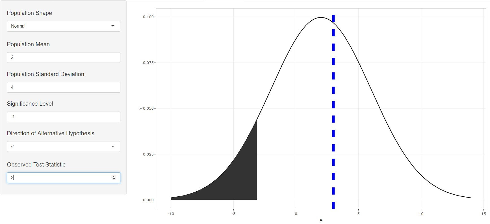
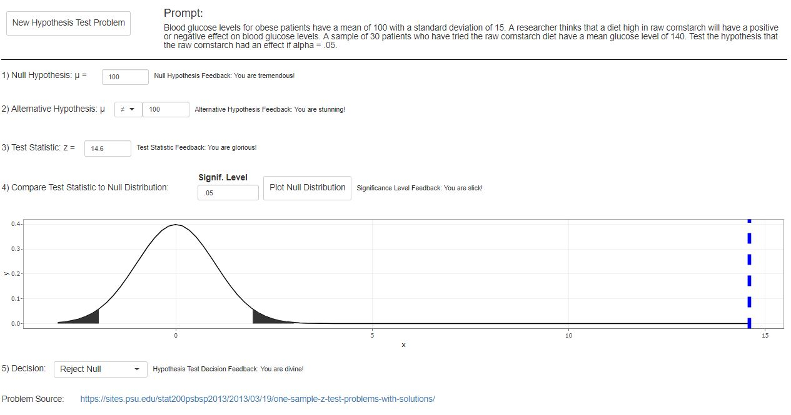
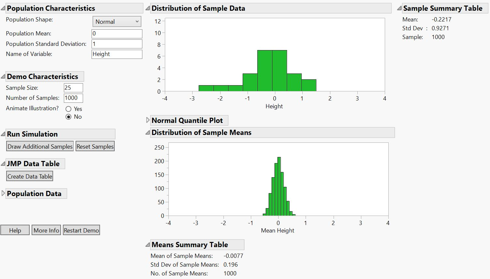
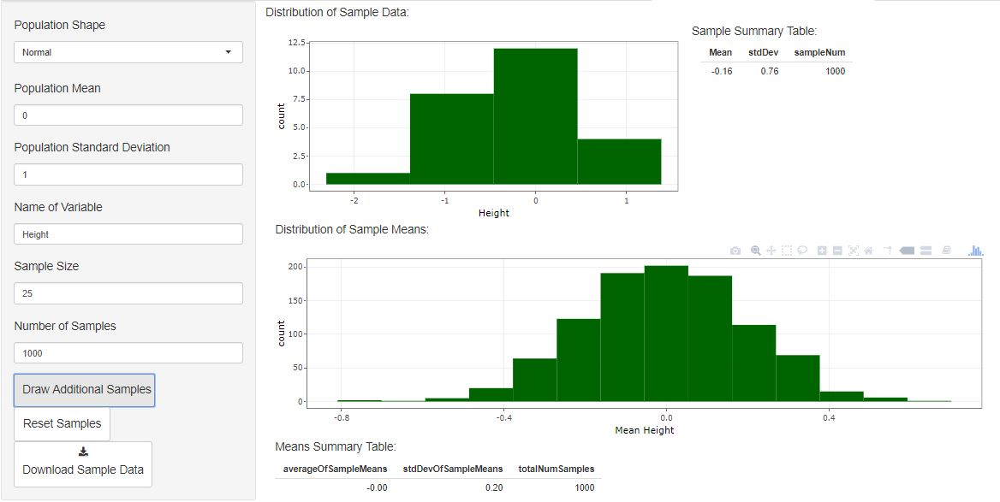

<style type="text/css">
.main-container {
  max-width: 2500px;
  margin-left: auto;
  margin-right: auto;
}
</style>

```{r echo=FALSE}
library(statsfoRdummies)
```

You can install the $\texttt{statsfoRdummies}$ package by running the following in your console.

```{r eval=FALSE}
devtools::install_github("https://github.com/jzemmels/statsfoRdummies")
```


While this vignette will show how the various functions within this package can be used from the console, the purpose of this package is mainly in-service to the shiny app that accompanies it. It is highly recommended to first launch the shiny app to follow along with this vignette. Assuming that you are in the package directory, you can launch the app by running the following in your console.

```{r eval=FALSE}
shiny::runApp(appDir = "inst/shiny")
```

## Eryn

## Gulzina

## Charlotte

## Joe

Last semester many of my STAT 101 students lacked an understanding of what they were doing when performing a hypothesis test. Many would simply memorized the procedure and formulas while lacking the intuition for how the procedure and formulas function. I remember frequently thinking that many students would gain a better understanding of, for example, why they reject null hypothesis when their $z$-statistic is far from 0 if they had an interactive, dynamic tool with which they could practice their hypothesis testing skills. This was the inspiration for part of my contribution to this project. I had the idea to create a visualization tool that students could use to graph a normal distribution density, specify a significance level and alternative distribution direction, and plot an observed $z$-statistic. I believed that having the ability to actually visualize the acceptance/rejection regions under a normal distribution density  might lead to a deeper understanding than simply checking whether the $p$-value is less than .05.

### plotNormal()

The function $\texttt{plotNormal()}$ allows the user to graph a normal distribution density by specifying a mean and standard deviation as well as an observed value to be graphed as a blue vertical dotted line. It also lets the user specify the signficance level of their test, which will be visualized as a shaded region under the density curve, as well as the direction of their alternative hypothesis. While not possible to show in this vignette, the user can also indicate whether they want a ggplot object to be returned or a more interactive plotly object.

The intent of this function is to give the user a way to visually determine whether their observed value falls in the critical region. This function is used by itself in the "Normal Plot" tab of the shiny app, but I believe its most useful inclusion is in the "Hypothesis Test Challenge" tab.

```{r fig.height=3}
plotNormal(mu=2,sigma=4,alpha=.1,obs=3,direction="<",plotly = FALSE)
```

<!--
Below is a snapshot of the usage of $\texttt{plotNormal()}$ in the "Normal Plot" tab of the shiny app.


-->

### Hypothesis Test Challenge

Along with the $\texttt{plotNormal()}$ function, another idea that I had was to make a Madlibs-style hypothesis test "game" in which students could practice the hypothesis test procedure while receiving real-time feedback. This is implemented in the "Hypothesis Test Challenge" tab of the shiny app. Under the hood, this app is simply making a call to a function I wrote, $\texttt{hypTest_prompt()}$, that randomly selects from a collection of hypothesis test prompts. Below is one example of using the function.

```{r}
set.seed(4282019)
hypTest_prompt()
```

The shiny app uses shiny's $\texttt{renderUI()}$ function to generate select/numeric input objects with which the user can interact. The app will give feedback based on whether the user's input agrees with the correct answer stored in the list returned by $\texttt{hypTest_prompt()}$.

<!--

-->

Once the user gets to the "Compare Test Statistic to Null Distribution" step of the procedure, they can visualize the null distribution (which should be a standard normal since they're taught to calculate $z$-statistics) to determine whether they should reject or fail to reject the null hypothesis. This is just making a call to the $\texttt{plotNormal()}$ function using the user input up to this point as arguments.

### Sampling Distribution of Sample Means Visualization Tool

The "Sampling Distributon of Sample Means" tab in the shiny app was inspired by a similar app that STAT 101 students periodically use in their lab assignments. This app is meant to demonstrate to students the fact that for a fixed sample size, the empirical sampling distribution of sample means converges in distribution to a normal distribution with mean equal to the population mean, $\mu$, and standard deviaton equal to the population standard deviation divided by the square root of the sample size, $\frac{\sigma}{\sqrt{n}}$. The main issue that I had with the original app was that it was written in JMP, which I prefer to avoid if at all possible. I thought that the tool would be more accessible to students if they could use it without having to install JMP.

This tool relies on 4 simple functions to generate, aggregate, and plot random normal data. The function $\texttt{randomSample()}$ generates just that, a dataframe containing a set of random samples from a normal distribution with a specified mean, standard deviation, and sample size.

```{r}
samp <- randomSample(mu=0,sigma=1,sampleSize=25,numSamples=100)
head(samp)[1:5] #not a great column naming scheme, but consistent.
```

The function $\texttt{randomSample_histogram()}$ takes the last of these random samples and plots the data as a histogram.

```{r fig.height=3}
randomSample_histogram(sampleData=samp,binwidth=.5,variableName="Yield",plotly=FALSE)
```

From here, we can use the $\texttt{updateSampleMeans()}$ function to create a new dataframe containing the sample means from the $\texttt{samp}$ dataset created above.

```{r}
means <- updateSampleMeans(sampleData=samp)
```

If the $\texttt{sampleMeans}$ argument of this function is left blank, a new dataframe will be created containing sample means. However, the user can pass a previously created data frame containing sample means that will updated with the sample means of the samples within $\texttt{sampleData}$.

```{r}
updatedMeans <- updateSampleMeans(sampleData=samp,sampleMeans=means) #append the same 100 sample means to the means df
all.equal(updatedMeans[1:100,1],updatedMeans[101:200,1]) #first 100 means are the same as the last 100 means
```

The dataset "sampleData_means" that comes with this package was created in a similar fashion as above, but with a population mean of 5 and population standard deviation of 2. We can use the $\texttt{sampleMeans_histogram()}$ function to plot the sample means data as a histogram.

```{r fig.height=3}
data("sampleData_means")
sampleMeans_histogram(sampleMeans=sampleData_means,binwidth=.1,variableName="Yield",plotly=FALSE)
```

<!--
Below is a picture of the original tool as seen in JMP.



And following is a picture of my version of the tool in shiny.


-->

### Future Work

(Joe) I would love to add $t$-distribution alternatives to all of the tools that I've created so far since this is a topic covered in STAT 101.
